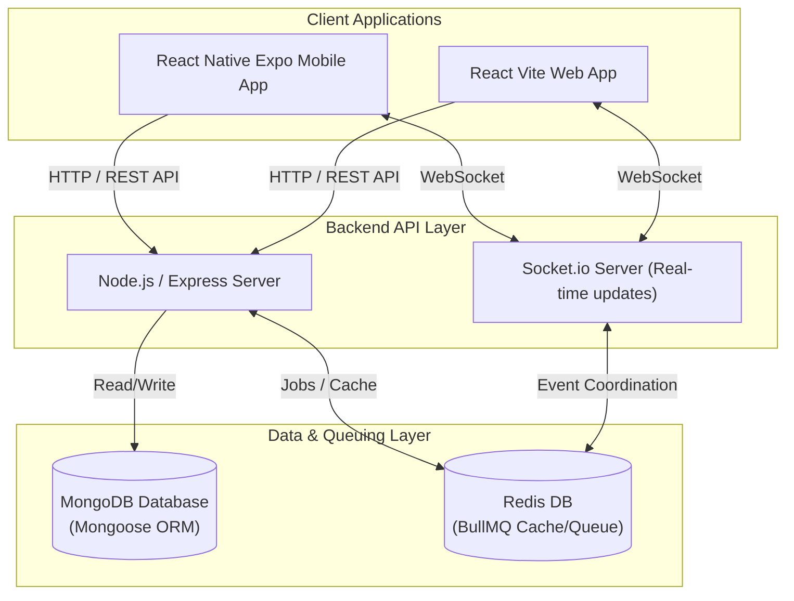
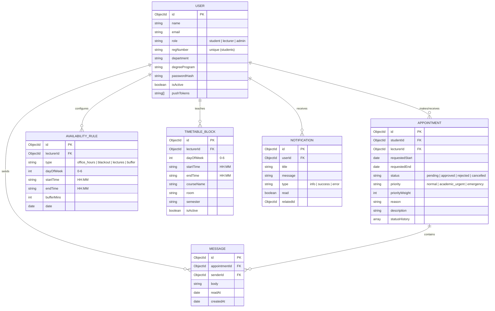

# UniSync — University Appointment System

**UniSync** is a premium, cross-platform appointment scheduling system purpose-built for university communities. It transitions the informal, email-heavy booking of student–lecturer meetings into a structured, timetable-aware, role-based scheduling ecosystem.

---

## 📐 Architecture Overview

UniSync is built on a decoupled, modern multi-tier architecture designed for scalability, real-time synchronization, and low-latency interaction.

### System Architecture



- **Client Applications**: Multi-platform clients share a common REST and WebSocket API. The web application serves administrators and desktop users, while the mobile application provides native capabilities (such as push notifications and cross-platform secure storage) for students and lecturers on the go.
- **Backend API Layer**: Powered by Express.js and TypeScript, handling business logic, authentication (JWT), file parsing (PDF/CSV/XLSX), and notification triggers. 
- **Real-time Synchronization**: Socket.io coordinates instant booking state updates and live messages between students and lecturers.
- **Data & Caching**: MongoDB Atlas acts as the persistent document database. Redis sits alongside as a caching layer for availability calculations and powers the BullMQ background worker system for booking reminders.

---

## 🗃️ Database Schema (ERD)

The system enforces relational integrity at the application level using Mongoose schemas. The database structure is mapped below:



---

## 🌟 Key Features

1. **Smart Availability Engine**: Evaluates a lecturer's recurring office hours, subtracts fixed teaching blocks (imported from Excel/CSV/PDF timetables), subtracts blackout periods, and returns verified, free booking blocks.
2. **Priority Override System**: Resolves schedule conflicts by evaluating the priority level of a booking (`Normal = 1`, `Academic Urgent = 2`, `Emergency = 3`). Higher-priority bookings override existing requests.
3. **Automated Reminders**: Redis-backed background queues send notifications to participants 24 hours and 1 hour before an upcoming meeting.
4. **Chat and File Sharing**: Every appointment establishes a secure direct chat room. Students can upload support documentation (such as medical certificates) directly from their device.

---

## 📂 Project Structure

```text
Uni Sync/
├── backend/                  # Node.js/Express Backend Server
│   ├── src/
│   │   ├── models/           # Mongoose schemas (User, Appointment, etc.)
│   │   ├── db.ts             # Database connection & memory fallbacks
│   │   ├── seed.ts           # Sample database seeder
│   │   └── index.ts          # Core Express API and Socket.io endpoints
│   ├── tests/                # Jest integration tests
│   └── package.json
├── frontend/                 # React Web Application (Vite)
│   ├── src/
│   │   ├── components/       # Shared UI components
│   │   ├── pages/            # Web layouts (Admin, Student, Lecturer Dashboards)
│   │   └── App.tsx           # Navigation & client routing
│   └── package.json
├── mobile/                   # React Native Expo Mobile App
│   ├── app/                  # Expo Router directory (File-based navigation)
│   ├── components/           # Screen UI modules
│   ├── hooks/                # Custom React hooks (auth, socket, toast)
│   └── package.json
└── login_credentials.md      # Development credential reference
```

---

## 🚀 Getting Started

### Prerequisites
- **Node.js** (v18 or higher)
- **npm** (v9 or higher)
- **MongoDB** (Local instance or Atlas connection)
- **Redis** (Optional: for reminders/queues)

### Setup Instructions

1. **Clone and Install Dependencies**:
   ```bash
   # Install backend dependencies
   cd backend
   npm install

   # Install frontend dependencies
   cd ../frontend
   npm install

   # Install mobile app dependencies
   cd ../mobile
   npm install
   ```

2. **Configure Environment Variables**:
   Create a `.env` file in the `backend/` and `mobile/` directories matching the templates below:

   **`backend/.env`**
   ```env
   PORT=3001
   MONGODB_URI=mongodb://localhost:27017/unisync
   JWT_SECRET=your_jwt_secret_key
   REDIS_URL=redis://localhost:6379
   FRONTEND_URL=http://localhost:5173
   ```

   **`mobile/.env`**
   ```env
   EXPO_PUBLIC_API_URL=http://localhost:3001
   ```

3. **Seed Database**:
   Seed initial development users, courses, and schedules:
   ```bash
   cd backend
   npm run seed
   ```
   *Note: For testing credentials, refer to [login_credentials.md](login_credentials.md) in the project root.*

4. **Run the Applications**:

   * **Backend**:
     ```bash
     cd backend
     npm run dev
     ```
   * **Frontend**:
     ```bash
     cd frontend
     npm run dev
     ```
   * **Mobile**:
     ```bash
     cd mobile
     npx expo start
     ```

---

## 📜 Development Documentation
- [Product Requirement Document (PRD)](UniSync_PRD.md)
- [Implementation Plan](UniSync_Implementation_Plan.md)
- [Login Credentials Guide](login_credentials.md)
